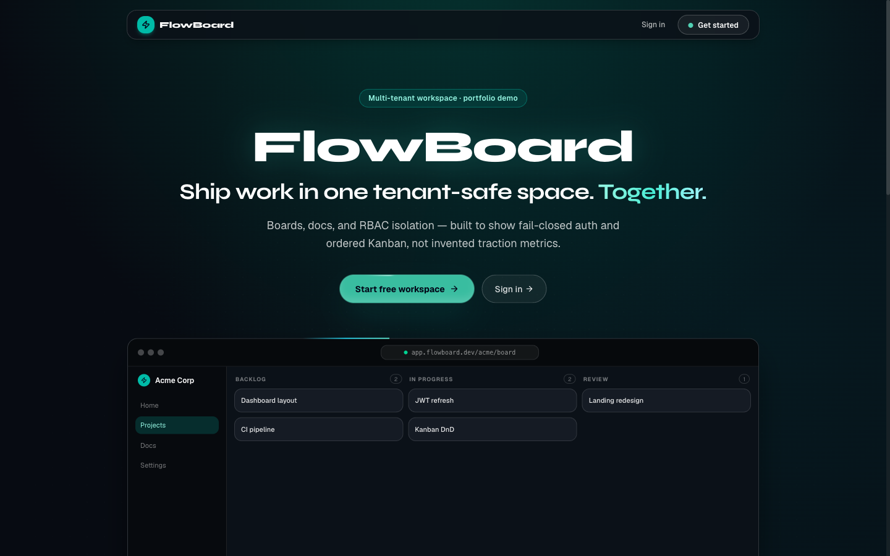

# FlowBoard

**Multi-tenant collaboration** · Backend / Full-stack · FastAPI · React · PostgreSQL · Redis

Workspace JWT/RBAC, ordered Kanban, TipTap docs, and Redis-backed realtime fanout — owned fail-closed tenant gates and WS membership — packaged as a Compose monorepo (`backend` · `frontend`) with a public Vercel + Neon demo.

[](https://github.com/Dhruva-Aher/FlowBoard/actions/workflows/ci.yml)

| | |
|--|--|
| **Demo** | [flowboard-iota-blond.vercel.app](https://flowboard-iota-blond.vercel.app) |
| **Focus** | Tenant authz · ordering · realtime gates |
| **Stack** | FastAPI · PostgreSQL · Redis · React · TipTap · Docker |

---

## Highlights

- **Correctness** — Fail-closed tenancy: non-member workspace/docs → **403**; WebSocket outsider closed **4003** before accept; Kanban column positions **0, 1, …**.
- **Correctness** — **62** pytest cases collected; documented green run **59** passed (unit + integration) against Postgres + Redis.
- **Latency (demo)** — Vercel→Neon window: `GET /health` p50 **129.8 ms** (n=5); SPA `GET /` p50 **48.4 ms** (n=5); register **615.6 ms** (n=1).
- **Operability** — Public smoke: SPA **200**, `/health` **ok** (`redis: null`), register → workspace → project **200** on Neon.
- **Realtime (Compose proof)** — Task move publishes a Redis channel event under pytest with Redis 7 (same schema as the app).



*Public Vercel + Neon demo (interactive walkthrough). Redis pub/sub fanout is proven under Docker Compose / pytest with Redis 7.*

| Metric on `/health` crop | Value |
|--------------------------|-------|
| `status` | **ok** |
| `environment` | **production** |
| `redis` | **null** |

`/health` crop: [`assets/health-ok.png`](./assets/health-ok.png) · Workspace with docs: [`assets/workspace-docs.png`](./assets/workspace-docs.png) · Evidence: [docs/METRICS.md](docs/METRICS.md)

---

## Architecture

| Component | Responsibility |
|-----------|----------------|
| **Frontend** | React/TS workspace UI — Kanban (dnd-kit), TipTap docs, Magic UI |
| **API** | FastAPI — JWT auth, RBAC matrix, REST + WS membership gate |
| **Postgres** | Tenant/workspace truth (Neon on demo; Compose locally) |
| **Redis** | Pub/sub fanout + presence on Compose; NullRedis on the Vercel demo |

```text
Client → FastAPI → Postgres (tenants / boards / docs)
              ↘︎ Redis pub/sub (Compose) → WS subscribers
              ↘︎ NullRedis stub when REDIS_URL unset (Vercel demo)
```

More: [docs/DECISIONS.md](docs/DECISIONS.md) · [docs/POSITIONING.md](docs/POSITIONING.md) · [docs/DEPLOY.md](docs/DEPLOY.md)

---

## Quick start

```bash
open https://flowboard-iota-blond.vercel.app
cp .env.example .env && docker compose up --build
```

Tests: `cd backend && pip install -r requirements-dev.txt && pytest tests/ -v`  
Deploy: [docs/DEPLOY.md](docs/DEPLOY.md)

---

## For interview depth

| Doc | Use |
|-----|-----|
| [METRICS.md](docs/METRICS.md) | Claim ↔ evidence grades |
| [DECISIONS.md](docs/DECISIONS.md) | Product / honesty decisions |
| [POSITIONING.md](docs/POSITIONING.md) | Differentiator vs peers |
| [INTERVIEW_GUIDE.md](docs/INTERVIEW_GUIDE.md) | How to present FlowBoard |
| [DEPLOY.md](docs/DEPLOY.md) | Vercel Services + Neon / Upstash |
| [XYZ_SCAFFOLDS.md](docs/resume/XYZ_SCAFFOLDS.md) | Resume XYZ worksheets |
